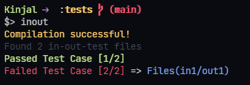

# in-out-test

> Simple CLI Application to run test cases through stdin and stdout.
> Create simple input-output test cases files and run them against your program.

## Install

Install globally in your system using:

```bash
npm install -g in-out-test
```

## Usage

### 1. Directory Structure

```bash
+
|-- io
|   |-- in
|   `-- out
|--main.cpp
`config.io.json
```

- The _`io`_ directory contains the test cases files
  - Files should be present in pairs (like (in, out), (in1, out1), etc.)
- `config.io.json` holds the configuration for in-out-test

### 2. `config.io.json`

Specify the `compile`, `run`, `compile_java` and `run_java` commands here.

```json
{
  "compile": "g++ main.cpp -o main",
  "compile_java": "javac main.java",
  "run": "main",
  "run_java": "java main"
}
```

> `compile` field is not mandatory

### 3. Run

```bash
inout
```

- Run the above command on the root directory to discover test cases from _`io`_ directory and run them
- If `compile` field is specified in the `config.io.json`, then it is run first before the `run` field

### 4. Output



> The files with the failed test cases are shown in the output!
